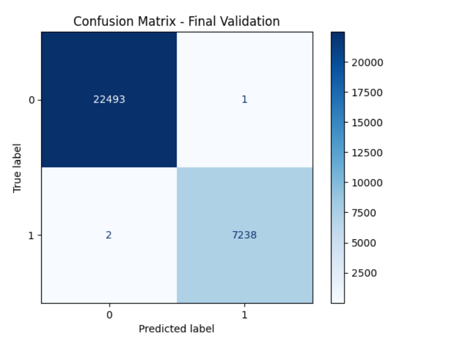
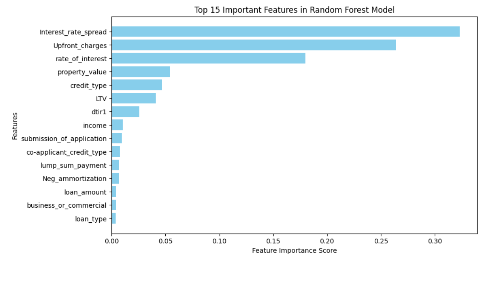
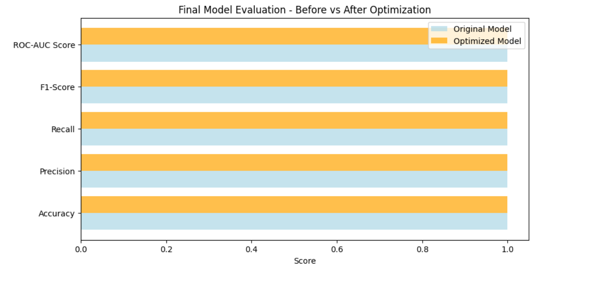
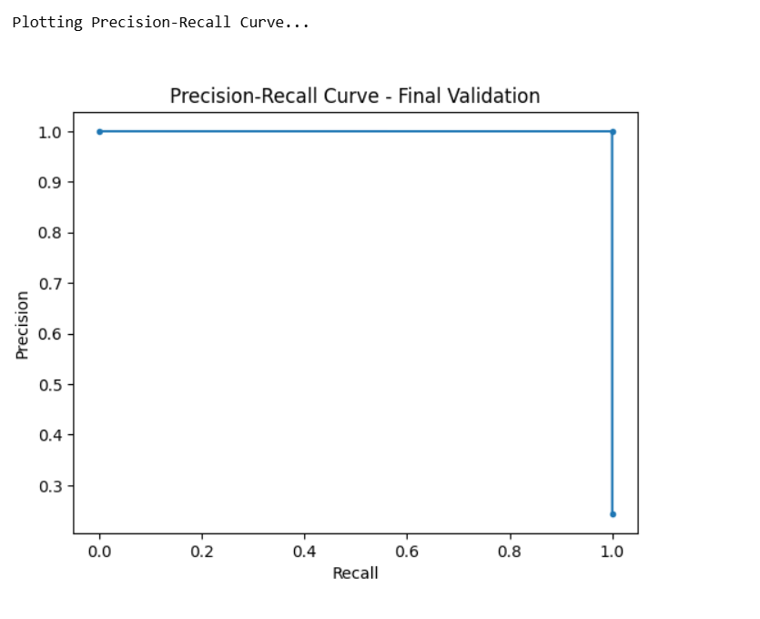

<<<<<<< HEAD
# 🧠 Loan Default Prediction using Machine Learning

## 📌 Project Overview

This project aims to build a **classification model** that predicts whether a borrower is likely to **default on a loan** using structured financial data. Accurate loan default prediction models help **banks and financial institutions** manage credit risk, reduce losses, and improve decision-making.

---

## 📂 Folder Structure

```
Loan-Default-Prediction/
│
├── 📁 data/                   
│   └── loan_data.csv         # Original dataset (not uploaded for privacy)
│
├── 📁 notebooks/
│   └── LoanDefault.ipynb     # Final Jupyter notebook (with all code & results)
│
├── 📁 presentation/
│   ├── ML-Midterm-Slides.pdf # Final slide deck used for video
│   └── Presentation_Script.txt
│
├── 📁 results/
│   └── screenshots/          # Key output images (confusion matrix, PR curve, etc.)
│
├── README.md                 # This file
└── requirements.txt          # List of required Python libraries
```

---

## 🛠️ Tools & Technologies Used

- **Language**: Python 3.11
- **Libraries**:  
  `pandas`, `numpy`, `scikit-learn`, `matplotlib`, `seaborn`
- **Modeling Techniques**:  
  - Logistic Regression  
  - Decision Tree  
  - Random Forest (Final Model)
- **Evaluation**:  
  - Confusion Matrix  
  - Precision-Recall Curve  
  - Cross-Validation  
  - ROC-AUC Score

---

## 📊 Dataset Information

- **Size**: ~148,000 rows, 33 features
- **Target Variable**: `Status` (0 = Non-Default, 1 = Default)

Features include:
- `LTV` (Loan-to-Value Ratio)  
- `rate_of_interest`  
- `loan_amount`, `property_value`, `income`, etc.  

---

## ✅ Methodology

### Step 1: Data Preprocessing  
- Checked for nulls, datatypes, and outliers  
- Converted target column `Status` to binary integers  
- Encoded categorical columns using One-Hot Encoding  
- Scaled numerical features

### Step 2: Exploratory Data Analysis  
- Correlation matrix plotted to detect multicollinearity  
- Verified absence of data leakage

### Step 3: Model Building  
- **Baseline Models**: Logistic Regression, Decision Tree  
- **Final Model**: Random Forest Classifier (with hyperparameter tuning)  

### Step 4: Evaluation  
- Confusion Matrix  
- Cross-validation (5-fold)  
- ROC-AUC Score  
- Precision-Recall Curve

---

## 🔍 Results

| Model              | Accuracy | ROC-AUC |
|--------------------|----------|---------|
| Logistic Regression| 60.00%   | 0.6000  |
| Decision Tree      | 100.00%  | 1.0000  |
| **Random Forest**  | **99.99%** | **0.9998**  |


📌 **Best Model**: Random Forest  
- Excellent cross-validation results (mean accuracy > 99.99%)  
- Confusion matrix shows minimal false positives/negatives  
- Precision and Recall are nearly perfect

---

## 🎥 Presentation Materials

- 📄 `notebooks/LoanDefault.ipynb`  

## 📸 Visual Outputs
📍 Confusion Matrix

Shows the model's classification performance:



📍 Feature Importance

Highlights which features contributed most to the prediction:



📍 Final Model Evaluation (Before vs After Optimization)

Performance comparison after tuning:



📍 Precision-Recall Curve

Shows balance between precision and recall:



---

## How to Run

1. **Clone the repository**

```bash
git clone https://github.com/your-username/Loan-Default-Prediction.git
cd Loan-Default-Prediction
```

2. **Install dependencies**

```bash
pip install -r requirements.txt
```

3. **Run the notebook**

```bash
jupyter notebook notebooks/LoanDefault.ipynb
```

---

## 📥 requirements.txt

```
pandas
numpy
matplotlib
seaborn
scikit-learn
```

---

## 💬 Final Reflection

> This project gave me a hands-on understanding of building a complete machine learning pipeline — from preprocessing and modeling to evaluation and validation.

As someone new to the field of Machine Learning, I tried my best to implement every required concept in a structured and thoughtful way. It was a great learning experience, especially in terms of handling real-world data, feature engineering, and model optimization.

I'm always open to feedback and improvement. If any part of this project can be enhanced, I’m happy to revisit and refine it further.
=======
# loan-default-prediction
A machine learning project to predict loan default using classification models, feature engineering, and evaluation metrics.
>>>>>>> 186c4ba669bcdfc964bef9c3ca85b934d56c3ee7
